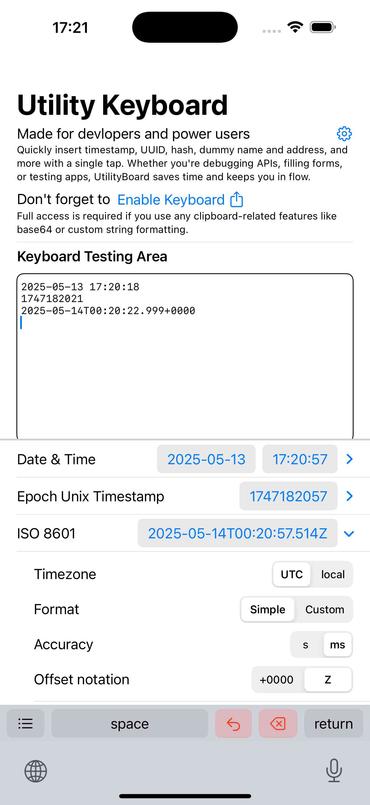
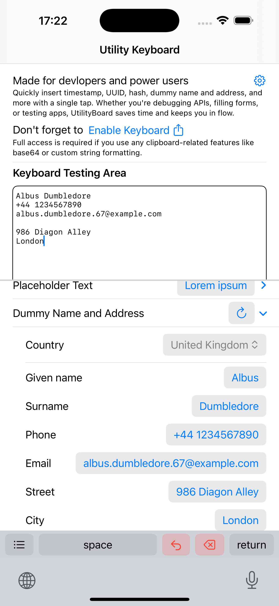
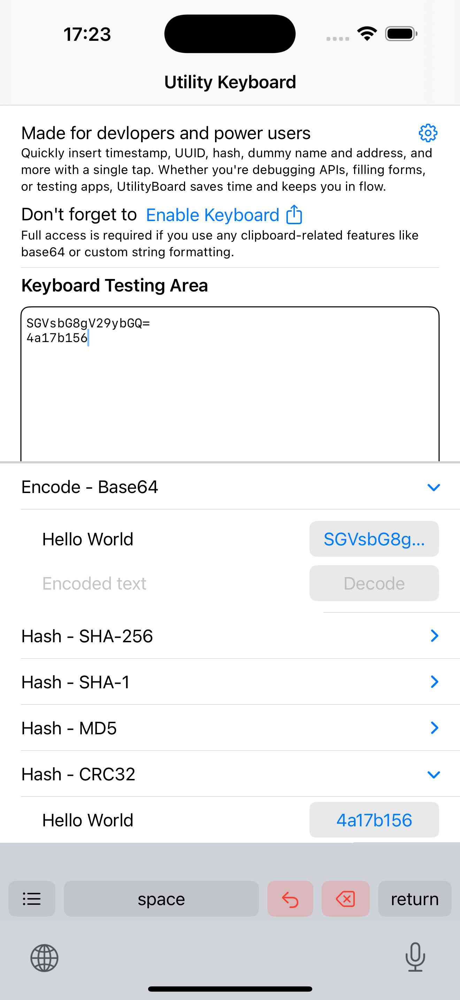

# Utility Keyboard for iOS

[⬇️ Download from App Store - for iOS 17+](https://apps.apple.com/us/app/utilkb/id6745785313)

A custom keyboard extension for iOS that helps developers, testers, and power users quickly insert useful content like UUIDs, timestamps, hashes, encodings, placeholder text, and dummy data — right from the keyboard.

## ✨ Features

- 📄 **Placeholder Text**
  - Lorem Ipsum
    - Words, sentences, paragraphs
    - UPPER / lower / Title Case / Sentence case
- 🏷 **Dummy Data**
  - Randomized names and addresses
    - With latin character dummy email addresses
  - Regional formats
    - CA, CN, JP, RU, UK, US
- ⏱ **Timestamps**
  - Epoch (seconds and milliseconds)
  - ISO 8601 (standard and compact, custom format)
- 🔑 **UUID**
  - v4 (UPPER and lower case)
- 🧬 **Encode & Decode**
  - Base2 (binary)
  - Base64
- 🔐 **Hash Functions**
  - SHA-256
  - SHA-1
  - MD5
  - CRC32

## 🧑‍💻 Ideal For

- Developers needing quick UUIDs or timestamps
- QA testers filling forms with dummy data
- Mobile engineers hashing or encoding test strings
- Anyone inserting technical boilerplate frequently

## 📱 How to Use

1. Install the app from the [App Store](https://apps.apple.com/us/app/utilkb/id6745785313).
2. Go to **Settings → General → Keyboard → Keyboards → Add New Keyboard...**
3. Select `UtilKB`.
4. Open any app and switch to the keyboard using the 🌐 globe icon.

> ⚠️ Full Access is needed if you use any clipboard-related features.

## 🔐 Privacy & Permissions

- **No network access.**
- **No data collection or tracking.**
- All generation logic is performed locally, securely, and offline.

## 📦 License

MIT License. See [LICENSE](./LICENSE) for details.

---

Made with ❤️ for developers, testers, and keyboard nerds.
